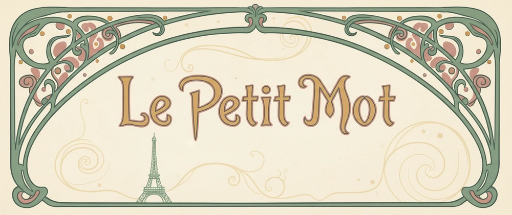

# petit mot

> *Learn to read Parisian French like a kid, one petit mot at a time.*

---

## The Problem

I'm going to Paris in 30 days and I don't speak French.

Not grammar-school French. Not verb conjugation tables. Just the words I'll actually need — at the café, on the Métro, at the boulangerie, in a museum. The kind of French a curious five-year-old would use to navigate a city they love.

Most language apps are built for long-term learners. They want streaks, points, and daily habits. I wanted something simpler: five words a day, a short story using those words, and a way to hear them spoken aloud. Thirty days, thirty themes, all Paris.

So I built it.

---

## What It Is

**petit mot** is a mobile-first French learning web app. It teaches basic Parisian French through:

- **Daily flashcards** — 5 vocabulary words per day, each with a French word, English translation, phonetic guide, and emoji. Tap to flip, tap to hear.
- **Story read-along** — A short 5-sentence Paris story using that day's words. Tap any sentence to hear it spoken. Vocab words highlighted in ochre. Toggle English translations on demand.
- **Le petit journal de Paris** — A daily audio journal narrated in simple French, reinforcing the day's vocabulary in context. Tap to play sentence by sentence.
- **30-day progress calendar** — Track which days you've completed. Progress persists across sessions via localStorage.

The full curriculum covers 7 days of Week 1 content across real Paris scenarios: greetings, the café, the Métro, the boulangerie, the musée, the arrondissements, and a week 1 review.

---

## How It's Built

### Deterministic by design

There are **zero runtime AI calls** in this app. Every word, story, and journal entry is hardcoded static data. The app is a plain HTML/CSS/JS static site — no framework, no build step, no server.

This was a deliberate choice. A language learning app needs to be:
- **Fast** — no API latency, no loading spinners
- **Reliable** — works offline, works on a plane to Paris
- **Auditable** — every word can be reviewed and corrected by a human

The content was generated at build time using Claude (via AWS Bedrock), then reviewed and committed as static data. After that, Bedrock is out of the picture entirely.

### The hybrid architecture

```
Build time:  Claude (Bedrock) → generates curriculum JSON → human reviews → committed to curriculum.js
Runtime:     Static HTML/CSS/JS → reads from curriculum.js → Web Speech API for audio
```

The seam is `curriculum.js`. It's just a JavaScript array. The UI reads from it. Bedrock wrote to it once. Neither side knows about the other.

### Stack

| Layer | Technology |
|-------|-----------|
| UI | Vanilla HTML / CSS / JS — no framework |
| Audio | Web Speech API (fr-FR, rate 0.7) |
| Storage | localStorage (progress tracking) |
| Fonts | Google Fonts — Playfair Display + Nunito |
| Deploy | Vercel free tier (static) |
| Content generation | AWS Bedrock / Claude (build-time only) |

### File structure

```
petit-mot/
├── index.html          # Entry point
├── css/
│   └── styles.css      # All styles, CSS variables, Art Nouveau palette
├── js/
│   ├── app.js          # View router, screen state
│   ├── curriculum.js   # Static content: all days, words, stories, journals
│   ├── flashcards.js   # Flashcard view
│   ├── stories.js      # Story read-along view
│   ├── journal.js      # Journal playback
│   ├── audio.js        # Web Speech API wrapper
│   ├── progress.js     # localStorage read/write
│   ├── tooltips.js     # French UI tooltip component
│   ├── calendar.js     # 30-day calendar view
│   └── ornaments.js    # SVG Art Nouveau components
├── vercel.json
└── site.webmanifest
```

Each file does one job. No god files.

---

## Design

**Aesthetic:** Art Nouveau Paris. Absinthe garden palette. Mucha poster energy.

The palette has one rule: each color has exactly one job.

| Color | Role |
|-------|------|
| Sage green `#5B7355` | Structure — arches, buttons, progress bar, navigation |
| Ochre `#C4956A` | Warmth — highlighted vocab, phonetic guide, ornament medallions |
| Dusty rose `#C27878` | Attention — Metro sign, "aujourd'hui" label, celebrations |
| Warm cream `#F2E8D5` | Canvas — page background |

SVG ornaments (iron arch, iron divider, Eiffel Tower, Metro sign) are rendered programmatically via `ornaments.js`. No emoji substitutes, no raster images.

---

## Curriculum — All 30 Days

The full 30-day curriculum is complete across 4 weeks, each with a narrative arc.

**Week 1 — First steps in Paris**

| Day | Theme | Scenario |
|-----|-------|----------|
| 1 | Bonjour, Paris! | Greetings, please, thank you |
| 2 | Au café | Ordering coffee, pastries, the check |
| 3 | Le Métro | Directions, tickets, excuse me |
| 4 | La boulangerie | Bread, pastries, numbers 1–5 |
| 5 | Au musée | Tickets, asking about art, colors |
| 6 | Les arrondissements | Left/right, numbers 6–10, neighborhoods |
| 7 | Révision! | Review — all week 1 vocabulary |

**Week 2 — Finding my rhythm**

| Day | Theme | Scenario |
|-----|-------|----------|
| 8 | Au restaurant | Ordering dinner, asking for recommendations |
| 9 | Le marché | Shopping for food, asking prices, quantities |
| 10 | Excusez-moi | Asking for help, polite phrases, being lost |
| 11 | Les couleurs | Describing things, shopping for clothes |
| 12 | Les chiffres | Numbers 11–20, prices, addresses |
| 13 | Au jardin | Parks, nature, relaxing outdoors |
| 14 | Révision! | Review — a full day using all week 2 vocabulary |

**Week 3 — I have favorite spots**

| Day | Theme | Scenario |
|-----|-------|----------|
| 15 | Le temps | Weather, seasons, making plans |
| 16 | Les directions | Navigating confidently, landmarks, near/far |
| 17 | Au bistro | Casual dining, wine, cheese |
| 18 | La Seine | The river, bridges, walking along the water |
| 19 | Les monuments | Famous landmarks, history, taking photos |
| 20 | Chez le fromager | Specialty cheese shop, asking to try, preferences |
| 21 | Révision! | Review — a full day exploring Paris |

**Week 4 — Paris feels like home**

| Day | Theme | Scenario |
|-----|-------|----------|
| 22 | Faire les courses | Grocery shopping, daily errands |
| 23 | Le petit déjeuner | Breakfast foods, morning routine |
| 24 | Au théâtre | Entertainment, buying tickets, expressing opinions |
| 25 | Les transports | Bus, taxi, getting around the city |
| 26 | La politesse | Formal greetings, please/thank you variations |
| 27 | Les émotions | Expressing feelings, happy/sad/tired |
| 28 | Révision! | Review — reflecting on the journey |
| 29 | Les adieux | Saying goodbye, making promises, gratitude |
| 30 | Félicitations! | Celebration, reflection, looking forward |

---

## Running Locally

No build step. Just open `index.html` in a browser.

```bash
git clone https://github.com/earlgreyhot1701D/petit-mot.git
cd petit-mot
open index.html
```

For audio to work, open via a local server (Chrome blocks Web Speech API on `file://`):

```bash
npx serve .
# or
python -m http.server 8000
```

---

## Deploying

The app is a static site. Deploy anywhere.

**Vercel:**
```bash
vercel --prod
```

Or connect the GitHub repo to Vercel and it deploys automatically on push.

---

## What's Next (Stubbed)

- **Audio journal v2** — Replace Web Speech API with Bedrock TTS (Amazon Polly) for higher quality French narration
- **Shareable progress card** — Screenshot of completion screen via html2canvas

---

*AI assisted. Human Reviewed. Powered by NLP.*
